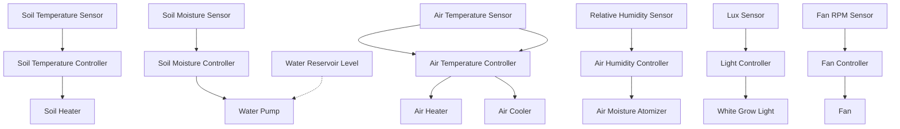
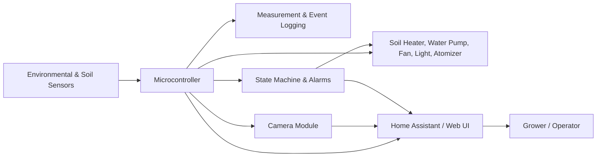

# GreenSeedling Core – Scope 1 Architecture

This document provides a complete **architecture overview for Scope 1** of the GreenSeedling Core grow box controller.  
It defines **subsystems, control loops, sensor-actuator relationships, data flow, wiring, safety interlocks, and state machine**.

---

## Contents
1. [System Overview](#1-system-overview)
2. [Control Loop Diagram](#2-control-loop-diagram)
3. [System Architecture / Data Flow](#3-system-architecture--data-flow)
4. [Wiring & Connectivity](#4-wiring--connectivity-scope-1)
5. [Safety Interlocks & State Machine](#5-safety-interlocks--state-machine)
6. [GPIO & Pin Assignments](#6-gpio--pin-assignments)
7. [Documentation Notes](#7-documentation-notes)
8. [Next Steps](#8-next-steps)

---

## 1. System Overview

**Scope 1 Subsystems:**

| Subsystem               | Purpose |
|-------------------------|---------|
| Microcontroller         | Core processing and control |
| Power Monitoring        | 220V AC input, 12V/5V/3.3V DC rails |
| Environmental Sensors   | Air temperature, relative humidity, lux sensor |
| Soil & Water Sensors    | Soil temperature, soil moisture, water reservoir level |
| Actuators               | Soil heating, air heating/cooling, fan, water pump, white grow light |
| Camera                  | Live view and timelapse recording |
| Safety & Alarms         | Visual and audible alarms, interlocks |
| User Interface          | Home Assistant integration or web UI |
| Logging                 | Measurement and event logging for all sensors and control outputs |

---

## 2. Control Loop Diagram

**Mermaid diagram (render locally in VS Code or other Markdown editor with Mermaid plugin):**

> Notes: Dashed arrow (`-.->`) indicates safety interlock (e.g., pump disabled if water low).

---

## 3. System Architecture / Data Flow

---

## 4. Wiring & Connectivity (Scope 1)

- AC input → DC power supply → MCU & actuators
- Shielded cables for sensors
- Relays/MOSFETs for high-current actuators
- Safety interlocks: pump disabled on low water, heater disabled on over-temp
- Camera connection to MCU

> **Placeholder:** Replace with actual wiring diagrams or Mermaid wiring diagram.

---

## 5. Safety Interlocks & State Machine

| State | Description |
|-------|-------------|
| HOLD  | Controller idle; no actuators active |
| RUN   | Normal operation; control loops active |
| ALARM | Unsafe condition detected; all actuators disabled |
| STOP  | Manual stop; safe state enforced |

**Rules:**  
- Start in **HOLD** mode  
- **ALARM** disables all outputs  
- Manual override only if safe  
- Full recovery requires confirmation  

---

## 6. GPIO & Pin Assignments (Scope 1)

| Component           | Pin     | Notes                     |
|--------------------|---------|---------------------------|
| Soil Temp Sensor    | GPIO 4  | DS18B20                   |
| Soil Moisture       | ADC1    | Capacitive sensor         |
| Water Pump          | GPIO 15 | Relay                     |
| Air Temp Sensor     | GPIO 5  | DHT22 or similar          |
| Air Humidity Sensor | GPIO 5  | Shared with Air Temp      |
| Fan                 | GPIO 16 | PWM control               |
| Soil Heater         | GPIO 17 | Relay / MOSFET            |
| Air Heater          | GPIO 18 | Relay / MOSFET            |
| Air Cooler          | GPIO 19 | Relay / MOSFET            |
| Atomizer            | GPIO 21 | Relay                     |
| White Grow Light    | GPIO 22 | PWM or relay              |
| Camera Module       | I2C/SPI | Depends on camera used    |

> Adjust pins based on your hardware and safety requirements.

---

## 7. Documentation Notes

- Track wiring changes, calibration offsets, and control loop tuning  
- Include images/screenshots for wiring, sensors, actuators, and camera setup  
- Keep Mermaid diagrams in sync with firmware updates  
- Future Scope 2+ enhancements will include recipes, multi-channel lighting, and camera triggers

---

## 8. Next Steps

1. Replace ASCII/placeholders with **full wiring diagrams**  
2. Define PID/threshold parameters for controllers and control loop frequency  
3. Verify and finalize GPIO assignments  
4. Add camera wiring & timelapse configuration  
5. Keep architecture synced with Scope 1 build guide  
6. Prepare placeholders for Scope 2 (recipes, growth stages, CO2 control)
